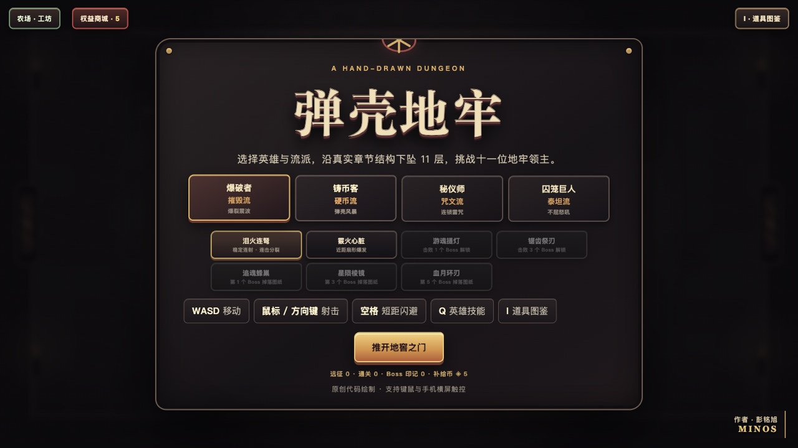
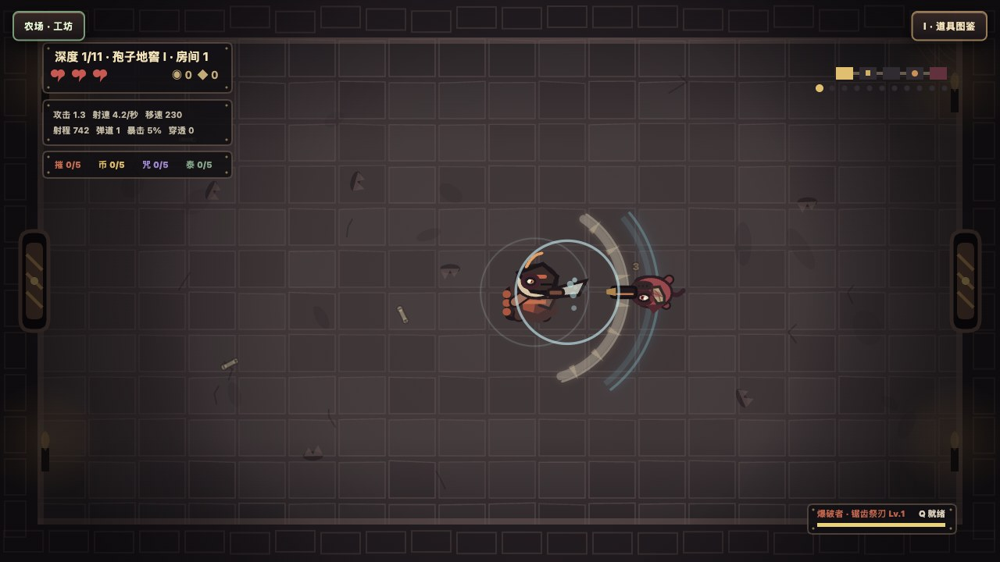
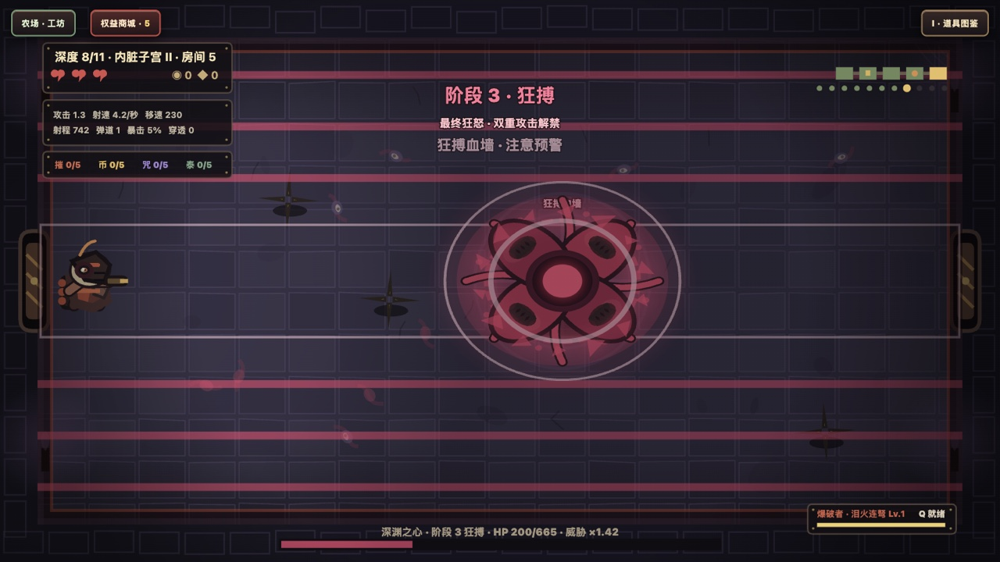
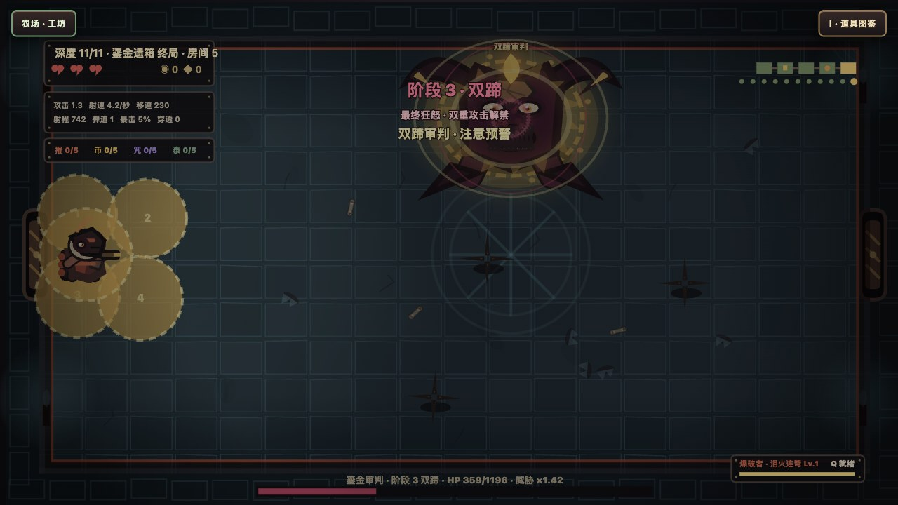
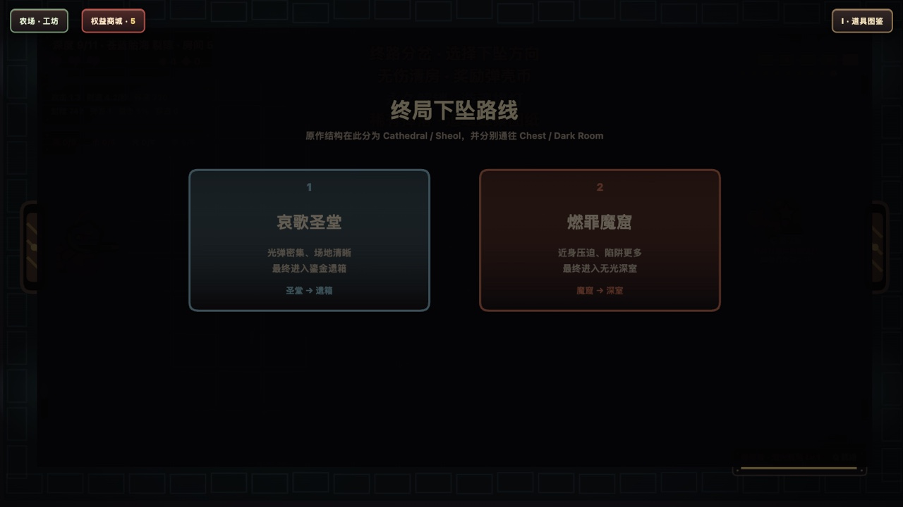
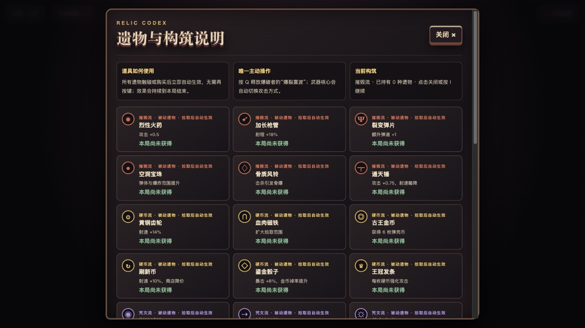
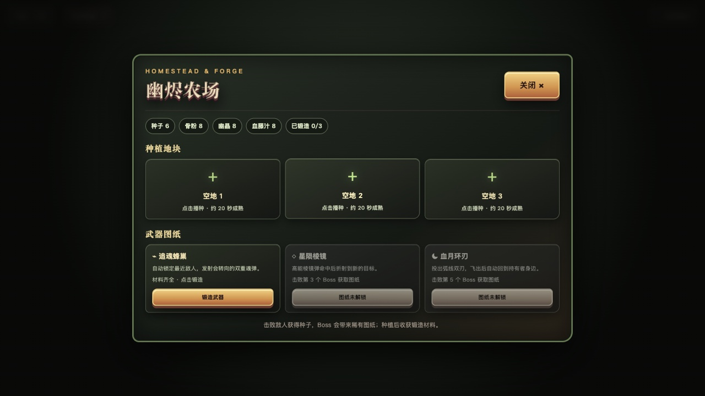
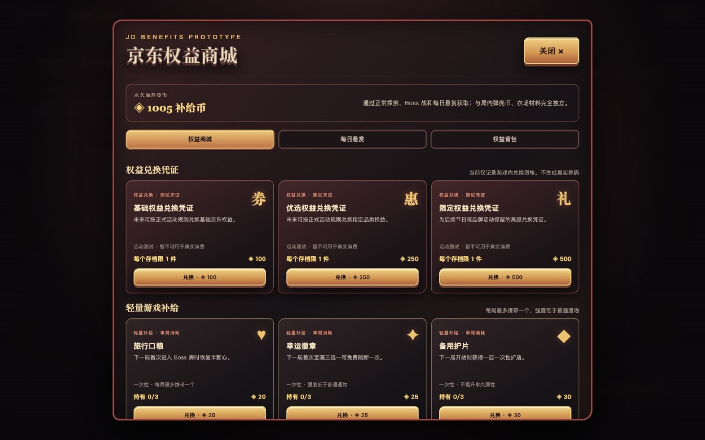
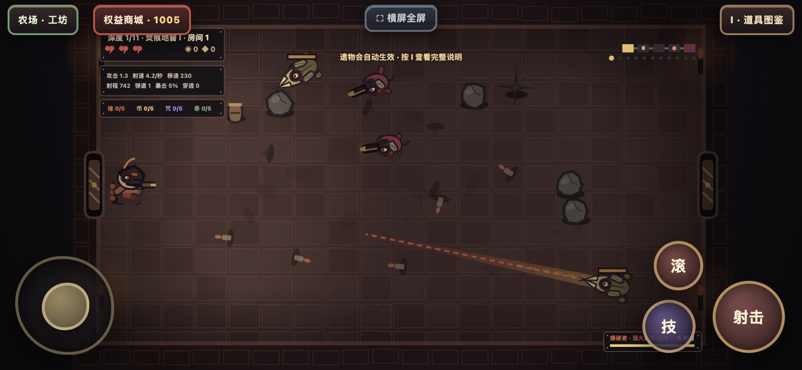

<div align="center">

# 弹壳地牢 · Dungeon Dodge

**原创手绘风俯视角肉鸽地牢 H5 游戏**

在 11 层地牢中探索、战斗、构筑流派并挑战 11 位拥有三阶段形态的领主。

<p>
  <a href="index.html"></a>
  <a href="game.js"></a>
  <a href="#操作方式"></a>
  <a href="#操作方式"></a>
</p>

### [▶ 在线试玩](https://mcp.edgeone.site/share/KhNqEgRtsJ2S-1vOlxBvn)

无需安装、无需登录，打开网页即可游玩。

</div>



## 游戏简介

《弹壳地牢》是一款使用原生 `HTML5 Canvas + JavaScript` 开发的单人肉鸽动作游戏。玩家需要在房间中躲避弹幕、击败不同职责的敌人，从遗物、武器和风险路线中做出选择，逐步构筑自己的战斗流派。游戏还加入了独立于局内成长的补给币与权益商城原型，用轻量补给、永久外观和测试兑换凭证承接长期游玩目标。

游戏借鉴经典俯视角地牢游戏的房间推进、弹幕战斗与随机构筑思路，但角色、怪物、Boss、场景和特效全部由代码原创绘制，不包含外部游戏美术资源。

> 探索 → 战斗 → 获得选择 → 构筑变强 → 承担风险 → Boss 检验 → 解锁新内容

## 游戏画面

<table>
  <tr>
    <td width="50%" valign="top">
      
      <br><b>七种差异化武器</b><br>
      泪火连弩、霰火心脏、游魂提灯、锯齿祭刃、追魂蜂巢、星陨棱镜与血月环刃拥有独立攻击逻辑和视觉反馈。
    </td>
    <td width="50%" valign="top">
      
      <br><b>三阶段 Boss 战</b><br>
      每位领主都会改变外形、数值和攻击方式。深渊之心在最终阶段使用狂搏血墙封锁走位空间。
    </td>
  </tr>
  <tr>
    <td width="50%" valign="top">
      
      <br><b>独立招牌攻击</b><br>
      11 位 Boss 拥有各自的预警、弹体轮廓和招牌技能，终局领主会使用双蹄审判制造连续危险区域。
    </td>
    <td width="50%" valign="top">
      
      <br><b>风险与收益抉择</b><br>
      选择安全路线恢复状态，或进入双誓险路迎战强化精英，以额外遗物和金币换取更高构筑上限。
    </td>
  </tr>
  <tr>
    <td width="50%" valign="top">
      
      <br><b>遗物与流派构筑</b><br>
      36 种遗物覆盖摧毁、硬币、咒文和泰坦流派，并提供燃烧、冻结、中毒、流血和感电联动。
    </td>
    <td width="50%" valign="top">
      
      <br><b>农场与武器锻造</b><br>
      战斗掉落种子，Boss 解锁图纸；种植作物获得骨粉、幽晶和血藤汁，再于工坊锻造永久武器。
    </td>
  </tr>
</table>

### 权益商城原型



正常探索、Boss 战、风险路线和每日悬赏会产出永久局外货币“补给币”。补给币与局内弹壳币、种子和农场材料完全隔离，可兑换不破坏战斗平衡的单局补给、纯外观内容和游戏内测试凭证。

### 手机横屏

移动端提供虚拟摇杆、射击、技能和翻滚按钮，并以 `16:9` 横屏完整展示 `1280 × 720` 战场。



## 内容规模

| 内容 | 当前版本 |
| --- | ---: |
| 地牢深度 | 11 层 |
| 战役房间 | 55 个 |
| Boss | 11 位 |
| Boss 独立形态 | 33 套 |
| 可选英雄 | 4 名 |
| 武器 | 7 种 |
| 遗物 | 36 种 |
| 基础敌人职责 | 8 类 |
| 状态效果 | 5 种 |
| 构筑流派 | 4 套 |
| 权益商城商品 | 9 件 |
| 每日悬赏 | 每日轮换 3 项 |

## 核心玩法

### 战斗与操作

- 移动包含加速、减速、碰撞、击退和短距无敌翻滚。
- 攻击提供命中停顿、震屏、受击闪白、伤害数字、粒子和方向性冲击反馈。
- 敌方危险攻击具有统一预警，角色受击后拥有短暂无敌时间。
- 追击、远程、冲锋、护盾、召唤、控制和精英词缀会组合形成不同战斗节奏。

### 武器构筑

- **泪火连弩**：稳定连续射击，周期性触发连击分裂。
- **霰火心脏**：近距离扇形爆发，适合贴近敌人快速输出。
- **游魂提灯**：由环绕角色的灵体从不同角度协同攻击。
- **锯齿祭刃**：宽幅近战斩击、短程刀波、近身护刃与弹幕格挡。
- **追魂蜂巢**：自动锁定目标并发射转向魂弹。
- **星陨棱镜**：高伤害折射弹，可在目标之间继续弹跳。
- **血月环刃**：飞出后回到角色身边的双重回旋刃。

### 探索与成长

- 战斗房、精英房、宝藏房、商店、圣所与 Boss 房共同组成战役。
- 宝藏三选一、商店购买和路线分岔让玩家持续进行构筑决策。
- 普通遗物拾取或购买后自动生效，武器核心会切换或升级攻击方式。
- 每局结束会清空临时构筑；武器图纸、农场材料和锻造武器属于局外成长。

### Boss 系统

- 11 位 Boss 均拥有三个阶段和三套独立身体轮廓。
- 阶段转换采用锁血机制，避免高伤构筑直接跳过完整战斗。
- 二、三阶段会增加新机制，而不是只提高生命和攻击数值。
- 招牌技能包含毒轮、天坠、吸积、螺旋弹幕、十字攻击、血墙、三光和双蹄审判等。

### 补给币与权益商城

- **独立经济**：补给币只由正常远征、首次击败 Boss 和每日悬赏产出，不与局内金币或农场材料互通。
- **轻量补给**：旅行口粮、幸运徽章和备用护片均为一次性消耗品，每局最多携带一个，强度低于普通遗物。
- **纯外观奖励**：赤金弹道、京红刀光和“补给先锋”称号永久保存，但不增加伤害、生命、掉落或攻击范围。
- **每日悬赏**：每天固定轮换 3 项任务，覆盖战斗房、击杀、闪避、商店、风险路线和 Boss 挑战。
- **防调试刷取**：使用清房、跳房、无敌、强制伤害等调试接口后，该局不结算补给币。

> **权益原型声明：** 当前兑换凭证仅为游戏内活动测试道具，不是京豆、优惠券或真实兑换码，无法用于真实购物抵扣。项目当前没有登录、京东 PLUS 或真实权益接口；未来正式接入时必须使用服务端账户、库存、风控和核销能力。

## 本地运行

项目没有第三方运行依赖，下载后直接打开 `index.html` 即可。

```bash
git clone https://github.com/HuaiMing999999/DiLao.git
cd DiLao
open index.html
```

如果浏览器限制本地文件，也可以使用任意静态服务器：

```bash
python3 -m http.server 8080
```

然后访问 `http://localhost:8080`。

## 操作方式

### 桌面端

| 操作 | 按键 |
| --- | --- |
| 移动 | `WASD` |
| 射击 | 鼠标左键或方向键 |
| 朝光标移动 | 按住鼠标右键 |
| 短距无敌翻滚 | `Space` |
| 英雄主动技能 | `Q` |
| 遗物图鉴 | `I` |
| 刷新宝藏（携带幸运徽章时） | `R` |

### 移动端

- 建议横屏游玩，可点击顶部“横屏全屏”。
- 左侧虚拟摇杆控制移动。
- 右侧按钮控制射击、英雄技能和翻滚。
- 射击支持自动寻找目标，松开按钮会立即停止攻击。

## 技术实现

- **渲染**：原生 Canvas 2D，角色、敌人、Boss、场景、UI 与粒子均由代码绘制。
- **架构**：零框架、零 npm 运行依赖，单页即可启动。
- **输入**：键盘、鼠标、Pointer Events 与移动端 Touch Emulation。
- **战斗**：固定职责敌人、组合遭遇、状态效果、精英词缀、阶段 Boss 状态机。
- **存档**：使用浏览器本地存储保存远征、补给币、权益背包、每日悬赏、图纸、农场和锻造进度。
- **发布**：将 HTML、CSS 与 JavaScript 内联为单文件静态版本部署到 EdgeOne Pages。

## 项目结构

```text
DiLao/
├── index.html                      # 页面、菜单和触控 UI
├── style.css                       # 界面与响应式布局
├── game.js                         # 游戏循环、战斗、绘制和系统逻辑
├── docs/
│   ├── images/                     # GitHub README 展示图片
│   └── ISAAC_BEHAVIOR_RESEARCH.md  # 章节与行为调研记录
└── tests/
    ├── smoke-test.js               # 核心逻辑回归
    ├── browser-audit.mjs           # 真实浏览器与移动端验收
    └── visual-audit.mjs            # 英雄、敌人和 Boss 视觉验收
```

## 测试与验证

```bash
node --check game.js
node tests/smoke-test.js
node tests/browser-audit.mjs
node tests/visual-audit.mjs
```

当前自动化测试覆盖：

- 55 个房间的完整通关与死亡流程。
- 11 位 Boss 的阶段转换、独立外形、攻击机制和单次伤害上限。
- 7 种武器、36 种遗物、5 种状态效果、4 套流派联动。
- 商店购买、宝藏选择、精英词缀、路线分岔、农场和锻造。
- 9 件权益商品、补给币结算、每日悬赏、权益背包、补给消耗与纯外观装备。
- 桌面键盘移动射击、移动端触控、松手停止射击和跨房间输入清理。
- 祭刃主斩、外圈刀波、近身弹反、超距失效与二三级成长。
- 4 名英雄、8 类普通敌人、33 套 Boss 形态及桌面/手机权益商城的真实浏览器截图验收。

## 美术与参考说明

项目调研了《以撒的结合：重生》的章节结构、Boss 行为和肉鸽构筑方式，并参考《挺进地牢》《元气骑士》《Hades》《死亡细胞》等作品的战斗反馈与风险选择设计。

本项目只借鉴玩法思想和行为模式。所有名称、数值、角色、怪物、场景、弹体与视觉素材均为原创代码绘制，不下载或复用原作美术资源。详细调研记录见 [`docs/ISAAC_BEHAVIOR_RESEARCH.md`](docs/ISAAC_BEHAVIOR_RESEARCH.md)。

## 当前限制

- 每层目前采用线性五房间结构，尚未实现可自由回溯的二维地图。
- 为保持本地直接运行和版权独立性，目前没有外部音乐文件，音效由浏览器实时合成。
- 权益商城目前是纯前端体验原型；真实权益不能依赖可修改的本地存档，正式上线前必须接入服务端校验与核销。

## 作者

**彭铭旭 · Minos**

如果你喜欢这个项目，欢迎试玩、提出反馈或点亮 Star。
